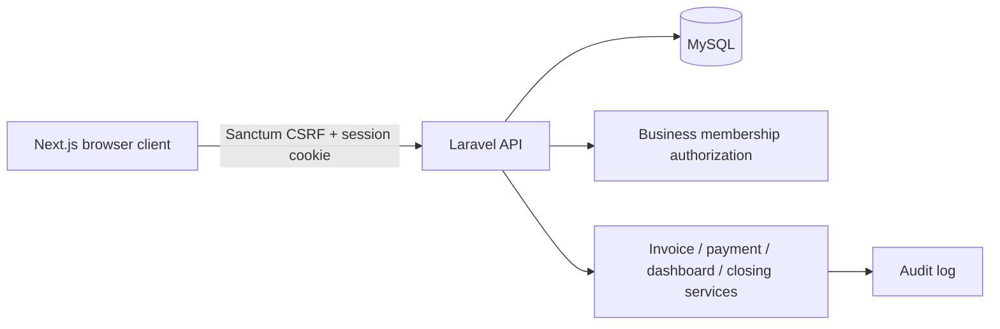
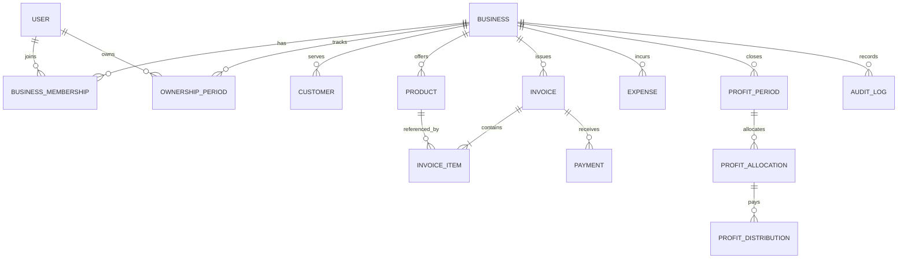

# Architecture and financial integrity

## System shape



The frontend and API are separate applications. Authentication uses Laravel’s stateful SPA pattern: the browser first requests a CSRF cookie and then signs in using a session cookie. The API remains responsible for authorization regardless of what the frontend hides.

## Multi-business tenancy

MeroBiz uses shared application tables with a `business_id` boundary rather than a separate database per business.

Tenant protection is applied through:

1. an active `business_memberships` record;
2. the `business.access` middleware;
3. Laravel scoped route bindings for nested resources;
4. controller permission checks;
5. queries that start from the authorized business relationship.

A URL containing another company’s invoice or expense ID should not bypass the business boundary.

## Core entities



## Why ownership is a period table

A single `businesses.owner_percentage` column would be historically unsafe. MeroBiz stores ownership and profit share as effective-dated records:

```text
user_id
business_id
ownership_percent
profit_share_percent
effective_from
effective_to
```

During live reporting, attributable profit is calculated by splitting the requested date range into ownership segments and applying the matching profit share to each segment.

During period closing, the resulting partner allocations are copied into immutable allocation rows. Later ownership edits therefore do not change a closed month.

## Invoice financial snapshot

Each invoice stores its calculated financial snapshot:

- subtotal;
- discount amount;
- tax amount;
- customer total;
- direct cost amount;
- gross profit amount;
- commission amount;
- paid amount;
- balance amount.

Each item stores the price, cost, discount, and tax rate used at the time of sale. Product catalogue changes do not rewrite historical invoices.

## Decimal handling

Database money fields use fixed decimal columns. Service calculations use a decimal helper backed by Brick Math rather than binary floating-point arithmetic for invoice/payment/closing operations.

Presentation code may convert API values for charting, but persisted financial results are calculated and rounded centrally in the API.

## Payment rules

A payment must:

- belong to the same business and invoice;
- have a positive amount;
- not exceed the remaining invoice balance;
- not be dated before the invoice;
- not be future-dated;
- not alter a protected closed period.

The service updates the invoice’s paid amount, balance, and status atomically with the payment record and audit log.

## Expense rules

An expense records:

- category and optional vendor;
- business date;
- amount and included tax;
- payment method;
- approval state;
- submitter and approver;
- reference and notes.

Only approved expenses affect net profit. Users with approval permission can approve immediately; other submitters create pending records. Removal uses soft deletion and audit history rather than silently destroying financial evidence.

## Profit and loss

For invoices dated inside the selected range:

```text
net_sales    = sum(subtotal) - sum(discounts)
gross_profit = net_sales - sum(direct_cost)
net_profit   = gross_profit - approved_expenses - commissions
```

Cash collection is independently selected by payment date. This correctly separates revenue performance from bank/cash movement.

Receivables in the report are balances on invoices dated inside the selected report range. A future aged-receivables module should instead provide a separate “as of date” balance report.

## Profit closing

Closing runs in a database transaction and stores a snapshot of:

- period start and end;
- net sales;
- cost of sales;
- gross profit;
- expenses;
- commissions;
- net profit;
- allocation percentages and amounts;
- who closed the period and when.

Guardrails prevent overlapping closed periods and protect dates inside a closed period from normal invoice, payment, and expense changes.

## Distribution versus allocation

An allocation is the owner/partner’s share of a finalized profit period. A distribution is cash actually paid against that allocation.

```text
remaining payable = allocated amount - recorded distributions
```

A distribution cannot exceed the remaining allocation and cannot be dated before the closed period ends.

## Employee commission

A business membership can store a commission rate. When an invoice is created, the invoice service determines the creator’s applicable rate and stores the commission amount on the invoice.

This avoids recalculating historical commission when the member’s current rate changes.

A future version can replace this simple rate with product-level, threshold, collection-based, or tiered commission rules without changing the distinction between invoice snapshot and current configuration.

## Inventory

Products can opt into inventory tracking. When an issued invoice contains a tracked product, the service checks stock and decrements it. Cancelling an unpaid issued invoice restores tracked stock.

The current scope does not include purchase receiving, stock transfers, batch/expiry tracking, or a full stock ledger.

## Currency boundary

Each business has one base currency. Changing it after financial records exist is blocked because relabelling old amounts would corrupt history.

The portfolio API returns:

- the detected currencies;
- whether the portfolio contains mixed currencies;
- a reporting currency only when it is safe to present one.

No automatic FX assumptions are made.

## Audit trail

Important actions create audit entries containing:

- business;
- actor;
- action;
- subject type and ID;
- before/after or contextual data;
- request metadata where available;
- timestamp.

The audit table is an application-level control, not a substitute for database backups, external logs, or a formal tamper-evident ledger.

## Security model

Implemented controls include:

- server-side sessions and CSRF protection;
- authentication rate limiting;
- per-business middleware;
- permission checks by role;
- nested resource scoping;
- guarded primary-owner membership;
- request validation;
- mass-assignment allowlists;
- password hashing through Laravel casts;
- closed-period protection;
- no internal cost on printed invoices.

Recommended production additions include MFA, email verification, password reset, device/session management, stronger rate-limit policies, CSP/security headers, malware scanning for future uploads, external logging, secrets management, and an independent penetration test.
